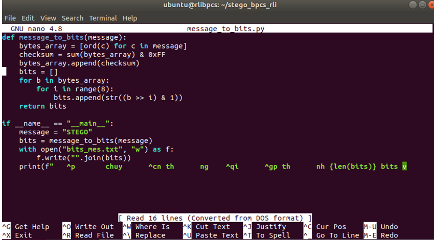
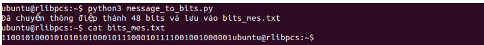
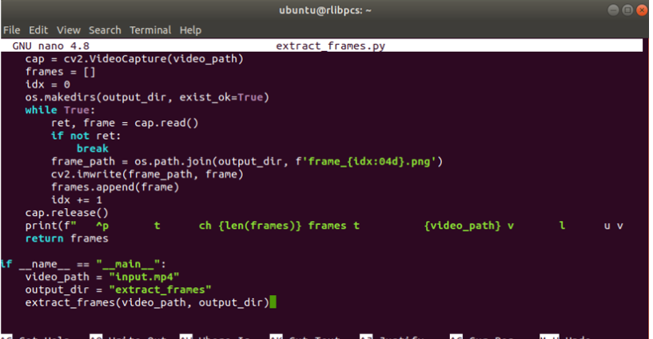
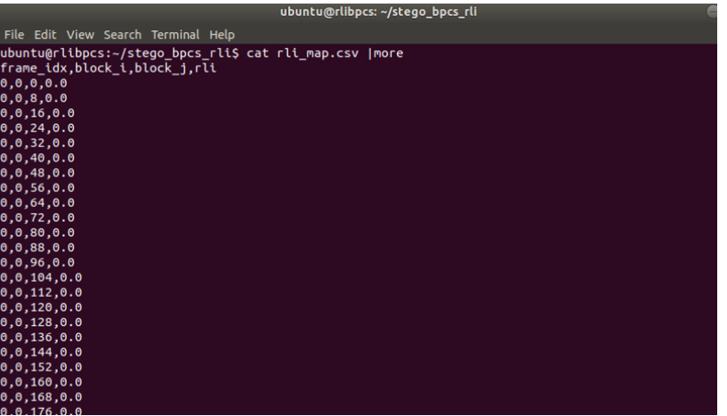
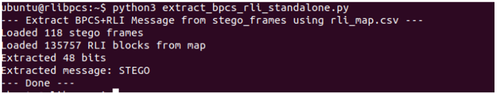

# RLI_BPCS – Giấu và tách tin trong video bằng BPCS kết hợp RLI

Repository phục vụ bài thực hành học phần Kỹ thuật giấu tin tại Học viện Công nghệ Bưu chính Viễn thông (PTIT).  
Nội dung bài lab tập trung vào kỹ thuật giấu và tách tin trong video dựa trên phương pháp BPCS (Bit Plane Complexity Segmentation) kết hợp RLI (Run Length Irregularity).

## Mục đích
- Hiểu nguyên lý giấu tin trong video bằng BPCS
- Kết hợp RLI để lựa chọn vùng thích hợp cho việc giấu tin
- Thực hành giấu và trích xuất thông điệp từ video mà không làm suy giảm chất lượng đáng kể

## Môi trường
- Labtainer
- Python 3
- OpenCV
- Linux

## Các file trong bài lab
- message_to_bits.py: Chuyển thông điệp sang dạng bit
- extract_frames.py: Tách các frame từ video
- rli_process.py: Tính toán RLI cho các khối ảnh
- embed.py: Giấu thông điệp vào video
- extract_bpcs_rli_standalone.py: Tách thông điệp đã giấu
- imodule.tar: Gói môi trường lab

## Hướng dẫn thực hiện

### Cài đặt môi trường
```bash
imodule https://github.com/thai1012/rli_bpcs/raw/refs/heads/main/imodule.tar
labtainer -r rli_bpcs
```

### Tải video đầu vào

```bash
curl -L "https://drive.google.com/uc?export=download&id=1eKEQlHXXAqRJZv3wu7EsRHRGOa_9ztlt" -o input.mp4 2> result.txt
```
### Chuyển thông điệp sang bit
### Thông điệp đầu vào: STEGO

```bash
python3 message_to_bits.py
cat bits_mes.txt
```



### Tách frame video

```bash
python3 extract_frames.py
```


### Các frame được lưu trong thư mục extract_frames.
### Tính toán RLI

```bash
python3 rli_process.py
cat rli_map.csv
```


### Giấu tin vào video

```bash
python3 embed.py
```
### Tách tin

```bash
python3 extract_bpcs_rli_standalone.py
```

### Thông điệp thu được giống với thông điệp ban đầu: STEGO.

### Kiểm tra kết quả

```bash
checkwork
```
### Kết thúc lab

```bash
stoplab
```
